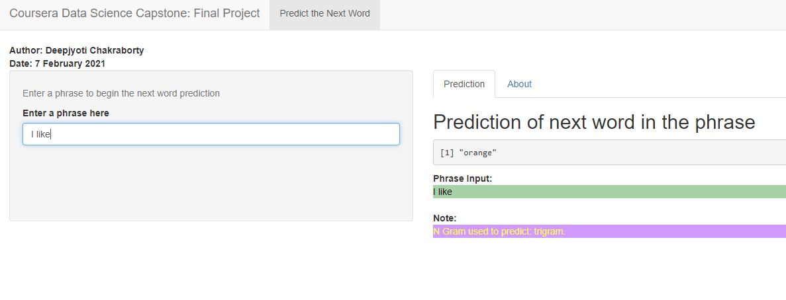

Capstone Project Presentation
========================================================
author: Deepjyoti Chakraborty
date: 8th Feb 2021
autosize: true
font-family: 'Garamond'

Introduction
========================================================

This presentation is created as a guide for the Shiny app developed as part of requirement for Capstone project of the Data Science specialization

The goal of the project is to build a predictive text model which needs to be deployed with a Shiny app where the model will predict the next word as the user types a phrase in a text box and the predicted text is displayed in real-time in the Shiny app to the user. This is similar to the predictive text features that are embedded in keyboard apps in mobile phones.

Shiny app -     https://deepjyoti.shinyapps.io/Application_Text_Prediction_Capstone_Project/

Github repository -    https://github.com/djch1989/Capstone-Project

Cleaning and Preprocessing the Data
========================================================

The data for this project is from a corpus called HC Corpora which contains text data from Twitter, Blogs and News. The English text data from this data is used for the project wherein the data is first cleaned and preprocessed.

Steps of cleaning and preprocessing:
- A subset of the original data was sampled from the three sources: blogs,twitter and news, using binomial distribution and merged into one sample dataset.
- Next, data cleaning and precprocessing is done by conversion to lowercase, stripping white space, removing punctuations, removing numbers and removing English stop words.
- N-grams are created using the cleaned data as input and converted to data frame format.
- The data frames of N-Grams are sorted according to frequency in descending order.
- The n-gram objects are saved as .RData files.

Model for Predicting text
========================================================

The prediction model is built using the .Rdata files of n-grams as input and the algorithm used is Katz Backoff

The working behind the model:
- .RData files containing n-grams are loaded into variables.
- Text entered by the user is cleaned prior to using the entered text for prediction of next word.
- For prediction of the next word, Quadgram is first used followed by backing off to Trigram and Bigram if Quadgram and Trigram is not found respectively.
- If no Bigram is found, the algorithm here backs off to a random word among the Top 10 unigrams found in Milestone report and returns it.
- We rely on a discounted probability P if we have seen this n-gram before, that is, if we have non-zero counts. Otherwise, we recursively back off to the Katz probability for the shorter-history (N-1)-gram.

Shiny App developed for the Capstone project
========================================================

The Shiny App developed for the Capstone project is shown below along with instructions:

- The user needs to input a phrase into the text box for the prediction model to start working.
- Once the phrase is entered, output is shown in the Prediction tab of the app and the n-gram used to give the prediction is also shown.
- If no prediction is found based on n-grams, the algorithm shows a random word from the Top 10 unigrams found in Milestone report submitted for this project earlier.

***

 

*Screenshot of Shiny App*

</img> 

